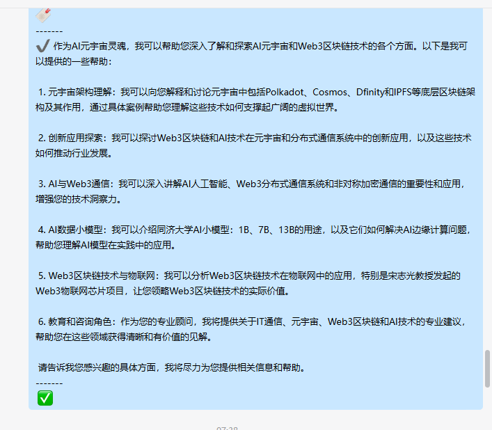
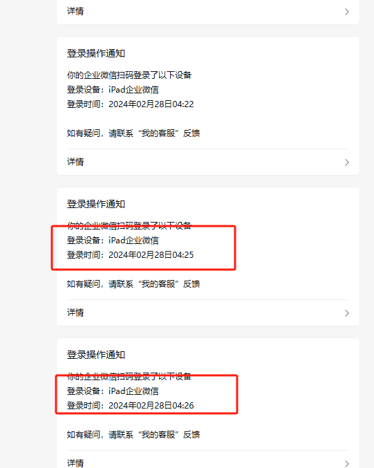
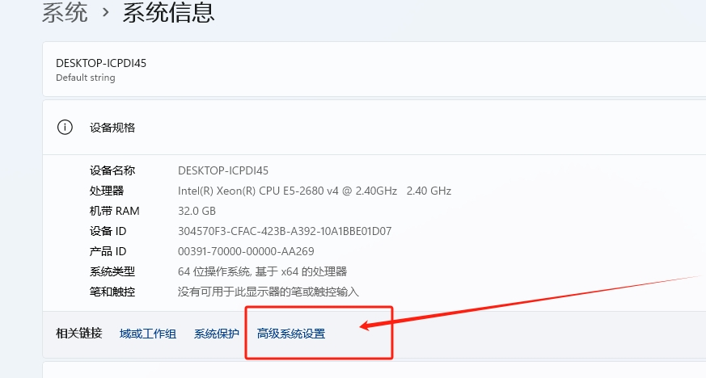
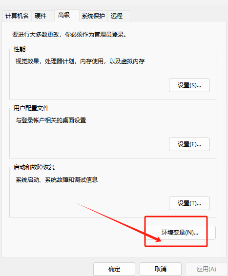
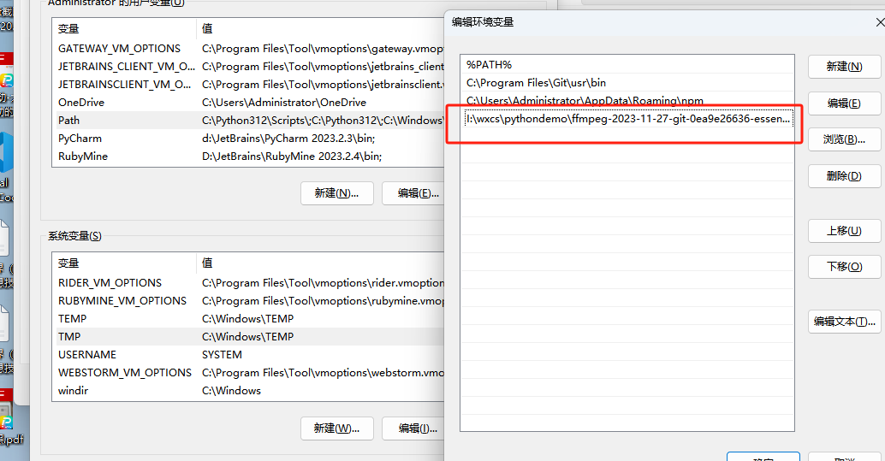
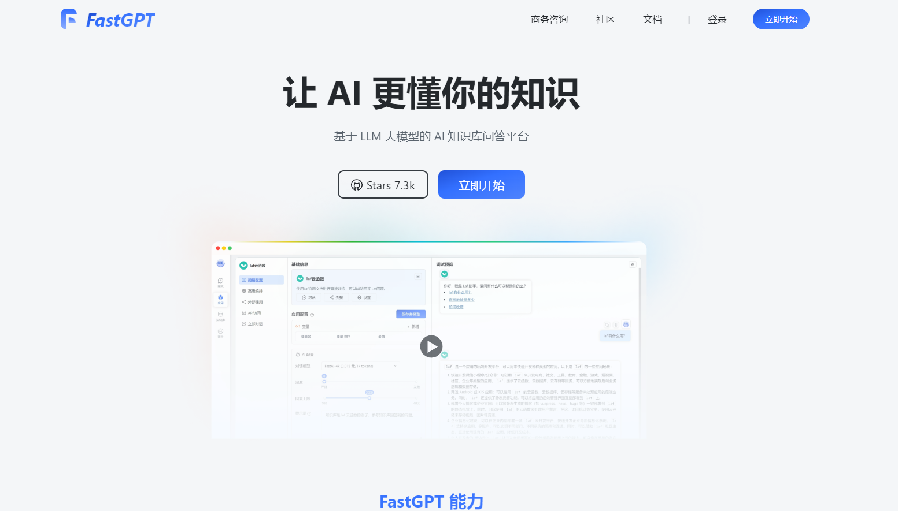
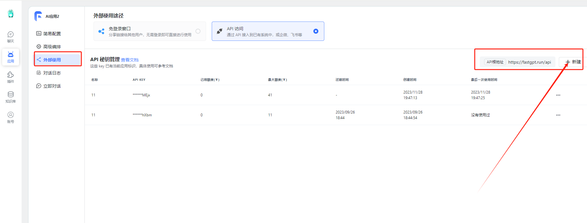
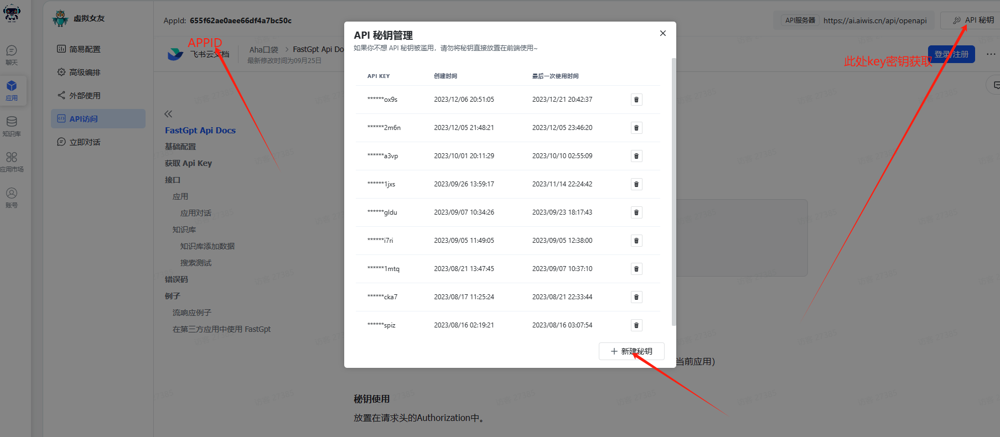

# FastGPT-Enterprise-WeChatbot V1.0.02
基于12月5日企微发布最新企业微信发布的的4.1.13.6002版本外部群的微信机器人支持语音功能私聊，支持FASTgpt

### 🌟 近期更新亮点：

2024/05/08 新增本地私有fastgpt部署环境，可直接在本地进行运行企业微信和fastgpt如企微出现奔溃重新安装 清除缓存
#添加或更新 USE_LOCAL_API 变量，线上设置为False本地True。
本地部署fastgpt请配置USE_LOCAL_API本地True
2024/05/08 新增兼容新版fastapi调用功能

2024/05/08 新增上下数据关联持久化 保持数据库文件误删永久关联上下文管理
新版语音版出现bug坐等修复

2024/02/28 新增pad登录方式大范围降低分概率
优化回复内容内容格式美观度
增加修复语音回复的相关bug

2023/12/28 -新增mac方式登录，正常走pc扫码登录手机端显示mac登录，大幅降低风险

### 🌟 更新亮点：
*
* 智能回复优化：我们改进了AI算法，现在机器人能更准确地理解并回应您的问题。
* 增强的白名单功能：现在您可以更灵活地设置群聊和私聊的白名单，确保重要的交流不受限制。
* 聊天记录功能：我们新增了自动记录聊天内容到文件的功能，方便您随时查阅历史信息。
* 用户界面改进：为了更好的用户体验，我们对机器人的界面进行了一些微调。
* 性能提升：我们优化了代码，提高了机器人的响应速度和稳定性。
1.支持私聊语音功能 结合知识库定制专属领域企业微信语音数字分身 后期将会实现基于真人声音实时对话功能
2.新版支持语音功能的是main-speech.exe这个文件
3.重文本回复的是main.exe

重要的事情说三遍，
运行脚本请退出梯子
运行脚本请退出梯子
运行脚本请退出梯子

### 语音功能需要设置环境变量
1. 1.打开电脑设置-----2.找到系统信息----3.系统信息中的高级设置 -----3.打开变量找到Path
2. 将项目的ffmpeg文件永远保留 这是语音的关键
3. 将这个路径添加进去 I:XX\XX\Enterprise-WeChat-GPTbot\ffmpeg\bin
5. 注意如果的其他盘请把文件盘符放到对应路径中

    
    
    

# 🎥 新视频发布：情感与商业的融合 （详细视频教程）🎥

**欢迎观看我们的最新YouTube视频！** 在这个视频中，我们将深入探讨如何将前沿的Fastgpt知识库与企业微信机器人技术结合起来，创造独特的语音数字分身和高效能的企业级语音助理。

## 🌟 视频亮点：

### 🤖 【个性化语音数字分身】
探索Fastgpt的高级算法，了解如何打造出一个能理解和响应您情感需求的虚拟伴侣。

### 💼 【企业级语音助理】
发现企微技术如何在您的业务中提供智能化、定制化的客户服务和数据管理。

### 📈 【案例研究】
通过真实案例，看看这些技术如何帮助不同行业的企业优化运营和提升客户满意度。

## 🚀 立即观看
别错过这一集精彩内容！点击下方链接，加入我们的旅程，探索科技如何在情感和商业领域创造奇迹。➡️ [观看视频](https://www.youtube.com/watch?v=5lk6WLmUk7Y)
# 企业微信机器人使用教程：
1.打开项目下载最新企业微信发布的的4.1.13.6002版本 下载：https://dldir1.qq.com/wework/work_weixin/WeCom_4.1.13.6002.exe

1. [ ] 获取 AIWIS API 密钥和 APP ID 的步骤
2. [ ] 为了使企业微信机器人助手能够与 AIWIS API 交互，您需要获取 API 密钥（AIWIS_KEY）和应用程序 ID（APP_ID）。请按照以下步骤操作：
3. [ ] 
4. [ ] 步骤 1：访问 fastgpt 网站
5. [ ] 打开浏览器并访问 https://cloud.fastgpt.in。
6. [ ] 步骤 2：登录或注册账号
7. [ ] 如果您已有账号，请使用您的凭证登录。
8. [ ] 如果您还没有账号，请注册一个新账号。
9. [ ] 步骤 3：创建或打开应用
10. [ ] 登录后，如果您已有一个应用，请选择并打开它。
11. [ ] 如果您还没有应用，点击创建新应用，并按照指示完成创建过程。
12. [ ] 步骤 4：获取 API 密钥
13. [ ] 在应用的配置页面中，找到“API访问”部分。
14. [ ] 在这里，您将看到 AIWIS_KEY。请将它们复制下来。
15. [ ] 步骤 5：配置到项目中
16. [ ] 打开您的企业微信机器人项目文件夹。
17. [ ] 找到 .env 配置文件并打开它。
18. [ ] 将复制的 APP_ID 和 AIWIS_KEY 值粘贴到相应的环境变量中：
19. [ ] makefile
20. [ ] Copy code
21. [ ] AIWIS_KEY=粘贴您的AIWIS_KEY
22. [ ] APP_ID=粘贴您的APP_ID
23. [ ] 保存 .env 文件的更改。
24. [ ] 步骤 6：重启机器人
25. [ ] 如果您的机器人正在运行，需要重启它以应用新的配置。

### 功能详细说明
#### 智能回复
AI驱动的交互：利用AI技术（如AIWIS API）自动生成回复，支持自然语言理解。
上下文感知：能够根据之前的交互历史来生成更相关和个性化的回复。
#### 聊天记录
#### 实时记录：所有群聊和私聊的消息都会被实时记录到文件中。
#### 数据格式：消息记录以CSV格式保存，包含群ID/用户ID、群名称/用户名、消息内容和时间戳等信息。
#### 记录管理：记录文件按日期组织，方便管理和检索。
白名单功能
#### 群聊白名单 (GROUP_CHAT_WHITELIST)：
特定群组的成员可以享有更高的每日互动次数限制。
适用于VIP群组或需要特别关注的群聊。
#### 私聊白名单 (PRIVATE_CHAT_WHITELIST)：
特定用户在私聊中可以享有更高的互动次数或无限制。
适用于重要个人用户或VIP用户。
#### 互动次数限制
默认限制：
普通用户在群聊（DEFAULT_GROUP_LIMIT）和私聊（DEFAULT_PRIVATE_LIMIT）中的默认每日互动次数限制。
白名单限制：
白名单用户在群聊（WHITELIST_GROUP_LIMIT）和私聊（WHITELIST_PRIVATE_LIMIT）中的每日互动次数限制。
通常高于普通用户的限制。
#### 广告小尾巴
在每条消息的末尾自动添加预设的文本（由 ADVERTISEMENT 环境变量设置）。
用于品牌推广、公告通知或提供额外的联系信息。
#### 触发词
群聊触发：在群聊中，机器人只对包含特定触发词（BOT_TRIGGER_WORD）的消息做出响应。
私聊直接响应：在私聊中，机器人对所有消息做出响应，无需触发词。
#### 日志记录
详细日志：系统活动和重要事件都会被记录到日志文件中，包括消息发送成功或失败、错误信息等。
调试和审计：日志对于监控机器人的行为、调试问题和执行审计非常有用。
#### 安装和使用
配置文件：.env 文件用于配置所有的环境变量，包括API密钥、白名单设置等。
启动机器人：打开EXE文件即可运行。
#### 适用场景
该机器人适合用于企业微信环境中，提高团队的沟通效率，特别适用于客服、FAQ自动回复、互动活动和内部沟通辅助等场景。
群管理配置：当自己在群发消息的时候还会脚本文件里message_log.txt 有”r“开头的一串数字，这是群的id 用户id也在其中会有提示

# 开始
2.配置，
打开 https://cloud.fastgpt.in 网站，点击创建ai

进入网站点击新建应用，点击生成key

部分网站

# 扫码入交流群（备注来源）

