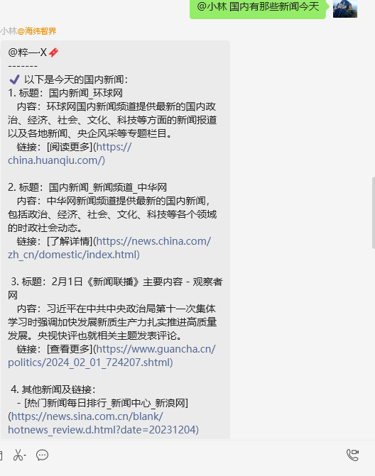
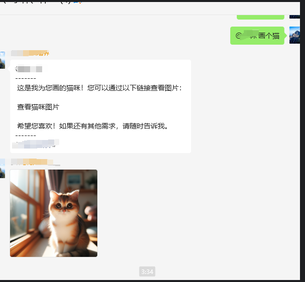

# Enterprise-WeChat-GPTbot V1.0.03

基于企业微信最新发布的 4.1.13.6009 版本，支持外部群的微信机器人语音功能私聊，并支持 FASTgpt。
- 企微版本，点击此处下载 [WeCom_4.1.22.6009.exe](https://dldir1.qq.com/wework/work_weixin/WeCom_4.1.22.6009.exe)

## 目录
- [更新日志](#更新日志)
- [演示图片](#演示图片)
- [快速开始](#快速开始)
- [企业微信机器人语音配置教程](#企业微信机器人语音配置教程)
- [语音配置教程](#语音配置教程)
- [视频教程](#🎥-新视频发布：情感与商业的融合-（详细视频教程）🎥)
- [功能详细说明](#功能详细说明)
- [企业微信机器人使用教程](#企业微信机器人使用教程)

fast建议使用本地模式
## 更新日志
 NextFlow-APP V1.0.07-beta.1 更新说明
 即将预增
https://github.com/luolin-ai/Enterprise-WeChat-GPTbot/releases/edit/1.0.07-beta.1


## 主要更新：
- 修复无法发送签名图片
- 修复返回为空的回复
- 优化 [http://127.0.0.1:8001/docs](http://127.0.0.1:8001/docs) 文档
- 修复部分 API 无法使用
- 新增文件发送群组 API，也可私发文件

-- 修复回复两次问题


- 优化广告小尾巴格式

### 2024年8月31日
- 新增文件发送功能
- 新增图片发送功能
- 基于 Fastgpt 插件实现可视化的调用
- 
## 演示图片

| 文件发送示例 | 图片发送示例 |
|:------------:|:------------:|
|  |  |
### 2024年8月27日
- 修复音频回复（目前仅支持私聊）

### 2024年7月6日
- 版本更新至 4 月 24 日企微发布的新版本，点击此处下载 [WeCom_4.1.22.6009.exe](https://dldir1.qq.com/wework/work_weixin/WeCom_4.1.22.6009.exe)
- 修复部分回复消息的 Bug

### 2024年5月8日
- 新增本地私有 Fastgpt 部署环境，可在本地运行企业微信和 Fastgpt
- fastgpt 添加或更新 `USE_LOCAL_API` 变量（线上设置为 `False`，本地设置为 `True`）
- 新增兼容新版 FastAPI 调用功能
- 新增上下数据关联持久化，防止数据库文件误删导致关联上下文丢失


### 🌟 更新亮点
- **智能回复优化**：改进了 AI 算法，使机器人更准确地理解并回应用户问题。
- **增强的白名单功能**：支持灵活设置群聊和私聊的白名单。
- **聊天记录功能**：新增自动记录聊天内容到文件的功能。
- **用户界面改进**：对界面进行了微调以提升用户体验。
- **性能提升**：优化代码，提升机器人响应速度和稳定性。
- **支持私聊语音功能**：结合知识库定制专属领域企业微信语音数字分身，未来计划实现基于真人声音的实时对话功能。

## 快速开始

### 获取 AIWIS-KnowAi API 密钥的步骤

1. **访问 AIWIS-KnowAi 网站**：
   - 打开浏览器并访问 [AIWIS-KnowAi 网站](https://ai.aiwis.cn)。
2. **登录或注册账号**：
   - 如果已有账号，使用凭证登录；否则，注册一个新账号。
3. **创建或打开应用**：
   - 登录后选择已有应用或点击“创建新应用”并完成创建。
4. **获取 API 密钥**：
   - 在应用的配置页面找到“API 访问”部分，复制 `AIWIS_KEY`。
5. **配置项目**：
   - 打开企业微信机器人项目文件夹，找到并打开 `.env` 文件，将 `AIWIS_KEY` 值粘贴到以下行：
   ```makefile
   AIWIS_KEY=粘贴您的AIWIS_KEY
   ```
6. **运行机器人**：
   - 双击 `newqi24.exe` 文件运行机器人。
7. **测试机器人**：
   - 在企业微信中向机器人发送消息，验证其响应和语音功能。

## 企业微信机器人语音配置教程

### 🎙️ 语音功能环境变量设置

1. **打开电脑设置**：
   - 进入 **系统信息** > **高级系统设置** > **环境变量**。
2. **保留项目的 `ffmpeg` 文件**：
   - 确保项目中的 `ffmpeg` 文件夹存在，因为它是语音功能的关键组件。
3. **将 `ffmpeg` 路径添加到环境变量**：
   - 将以下路径添加到系统的 `Path` 变量中：
   ```
   I:\XX\XX\Enterprise-WeChat-GPTbot\ffmpeg\bin
   ```
4. **图片参考**：
   <div style="display: flex; justify-content: space-around;">
       
       
       
   </div>

## 语音配置教程

### 1. 获取 AIWIS-KnowAi 语音 API 密钥

- 访问 [AIWIS-KnowAi API](https://api.aiwis.cn/)。
- 登录或注册账号。
- 获取 `AIWIS_speech_KEY` 并在 `.env` 文件中添加以下内容：

```makefile
AIWIS_API_URL=你的代理地址
AIWIS_speech_KEY=粘贴您的AIWIS_speech_KEY
```

### 2. 配置语音模型

AIWIS-KnowAi 提供两种 TTS 模型：

- `tts-1`
- `tts-1-hd`

在 `.env` 文件中选择所需的模型：

```makefile
TTS_MODEL=tts-1  # 或者 tts-1-hd
```

# 扫码入交流群（备注来源）
# 扫码入交流群（备注来源）

# 🎥 新视频发布：情感与商业的融合 （详细视频教程）🎥

[](https://www.youtube.com/watch?v=5lk6WLmUk7Y)

**欢迎观看我们的最新YouTube视频！** 在这个视频中，我们将深入探讨如何将前沿的Fastgpt知识库与企业微信机器人技术结合起来，创造独特的语音数字分身和高效能的企业级语音助理。

## 🌟 视频亮点：

### 🤖 【个性化语音数字分身】
探索Fastgpt的高级算法，了解如何打造出一个能理解和响应您情感需求的虚拟伴侣。

### 💼 【企业级语音助理】
发现企微技术如何在您的业务中提供智能化、定制化的客户服务和数据管理。

### 📈 【案例研究】
通过真实案例，看看这些技术如何帮助不同行业的企业优化运营和提升客户满意度。

## 🚀 立即观看
别错过这一集精彩内容！点击下方链接，加入我们的旅程，探索科技如何在情感和商业领域创造奇迹。➡️ [观看视频](https://www.youtube.com/watch?v=5lk6WLmUk7Y)

## 企业微信机器人使用教程
~~1. 打开项目下载最新企业微信发布的的4.1.13.6002版本 下载：https://dldir1.qq.com/wework/work_weixin/WeCom_4.1.13.6002.exe~~

## 开始
2. 配置，
   打开 https://ai.fastgpt.in/ 网站，点击创建ai
   
   进入网站点击新建应用，点击生成key
   
   部分网站
   

### 功能详细说明
#### 智能回复
AI驱动的交互：利用AI技术（如AIWIS API）自动生成回复，支持自然语言理解。
上下文感知：能够根据之前的交互历史来生成更相关和个性化的回复。

#### 聊天记录
- 实时记录：所有群聊和私聊的消息都会被实时记录到文件中。
- 数据格式：消息记录以CSV格式保存，包含群ID/用户ID、群名称/用户名、消息内容和时间戳等信息。
- 记录管理：记录文件按日期组织，方便管理和检索。

#### 白名单功能
- 群聊白名单 (GROUP_CHAT_WHITELIST)：特定群组的成员可以享有更高的每日互动次数限制。
- 私聊白名单 (PRIVATE_CHAT_WHITELIST)：特定用户在私聊中可以享有更高的互动次数或无限制。

#### 互动次数限制
- 默认限制：普通用户在群聊

...

